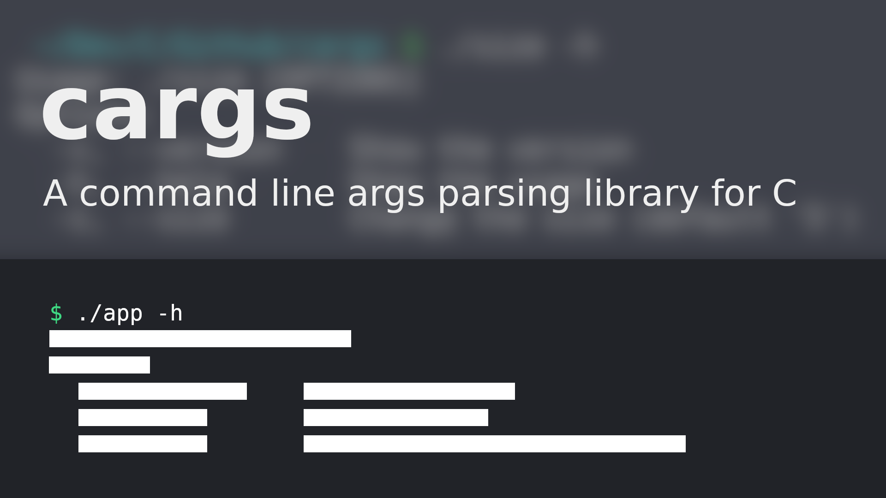
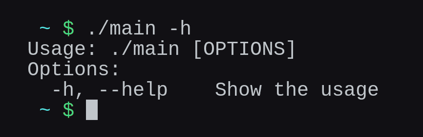

<h1 align="center">cargs</h1>
<p align="center">
	<a href="./LICENSE">
		
	</a>
	<a href="https://github.com/LordOfTrident/cargs/issues">
		
	</a>
	<a href="https://github.com/LordOfTrident/cargs/pulls">
		
	</a>
	
	<br><br><br>
</p>

A simple single-header [STB-style](https://github.com/nothings/stb) C library for parsing command line arguments and flags (similar to
Golang's flag package).

## Table of contents
* [Simple example](#simple-example)
* [Quickstart](#quickstart)
* [Bugs](#bugs)

## Simple example
```c
#include <stdio.h>

#define CARGS_IMPLEMENTATION
#include "cargs.h"

int main(int argc, const char **argv) {
	args_t a = new_args(argc, argv);
	const char *app_name = args_shift(&a);

	bool help = false;
	flag_bool("h", "help", "Show the usage", &help);

	args_parse_flags(&a, NULL, NULL);
	if (help) {
		args_print_usage(stdout, app_name, "[OPTIONS]");
		return 0;
	}

	printf("Hello, world!\n");

	return 0;
}
```
Output



## Quickstart
Since cargs is a single-header library, you can just copy [`cargs.h`](./cargs.h) into your project
and include it. [See the example](./examples/size.c) to see how to use the library.

To compile and run the example, run
```sh
$ cc ./examples/size.c -o size
$ ./size -h
```

## Bugs
If you find any bugs, please create an issue and report them.
